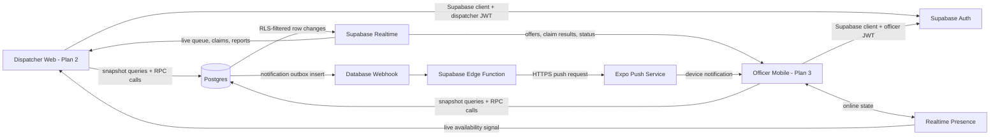
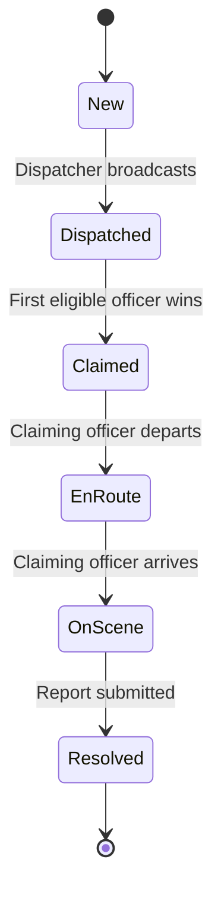
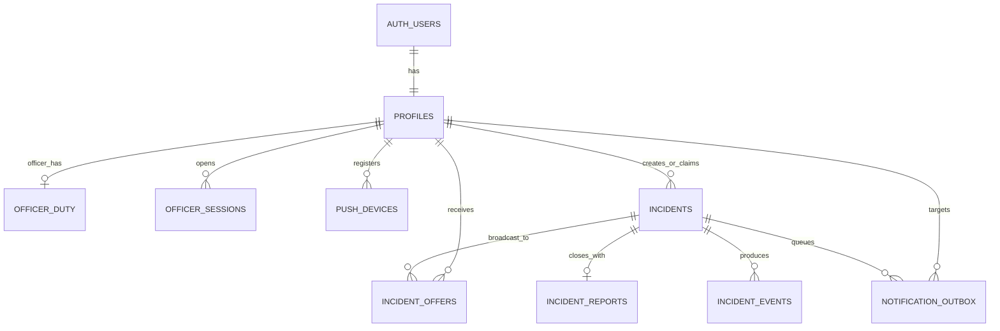

# MiniCAD Plan 1 of 3: Supabase Backend and Overall Functionality

**Project:** MiniCAD - Small-Scale Computer-Aided Dispatch  
**Workstream:** Shared backend, security, realtime data, presence, push orchestration, and end-to-end business rules  
**Status:** Planning document - no production implementation is contained here  
**Prepared:** 03 September 2026  
**Related future plans:** Plan 2 - Dispatcher Web; Plan 3 - Officer Mobile

---

## 1. Purpose of this plan

This document explains how we intend to build the single Supabase backend that will serve both the dispatcher website and the officer mobile application. It is written for two audiences at once:

- A non-technical reviewer can follow the operational flow and understand why each backend component exists.
- A technical reviewer can inspect the proposed tables, security boundaries, state transitions, realtime strategy, RPC contracts, failure handling, and test plan.

The backend will be the source of truth. The website and the mobile application will never maintain separate copies of operational truth. They will authenticate against the same Supabase project, read the same secured Postgres data, call the same controlled business operations, and receive changes from the same realtime system.

This plan deliberately does not define screen layouts, component libraries, website navigation, or mobile visual design. Those decisions belong to Plans 2 and 3.

## 2. Executive summary

MiniCAD will use one Supabase project for:

- **Postgres:** durable incident, dispatch, officer, report, event, and notification data.
- **Supabase Auth:** seeded dispatcher and officer accounts with persistent authenticated sessions.
- **Row Level Security (RLS):** database-enforced access control for both applications.
- **Database functions (RPCs):** controlled, transactional operations such as dispatching, claiming, advancing status, and submitting a report.
- **Supabase Realtime:** live Postgres change subscriptions and Presence events over WebSockets.
- **Supabase Edge Functions:** trusted server-side delivery of Expo push notifications.

The required operational loop is:

```text
Dispatcher creates incident
    -> incident is NEW
Dispatcher dispatches incident
    -> eligible officer pool is captured as a recipient snapshot
    -> incident becomes DISPATCHED
    -> push jobs are created
Eligible officers receive device push and a live in-app update
    -> first valid claim wins atomically
    -> incident becomes CLAIMED
    -> every other offer becomes EXPIRED immediately
Claiming officer advances to EN_ROUTE and then ON_SCENE
Officer submits one final report
    -> report and RESOLVED status commit together
Dispatcher receives the report and final status in realtime
```

The design favors correctness over cleverness. Postgres holds canonical state; realtime messages make that state feel immediate; reconnecting clients always reconcile from a fresh database snapshot so missed WebSocket events never require a manual refresh or a new login.

## 3. Definition of success

The backend is successful when all of the following are demonstrably true:

1. Only an authenticated dispatcher can create or dispatch an incident.
2. Dispatch is a broadcast to the officers who are eligible at dispatch time, not a manual one-to-one assignment.
3. An officer controls their own on-duty state; the dispatcher cannot change it.
4. Logged-out, off-duty, or already-responding officers are not included in the dispatchable pool.
5. A dispatch creates real device push notifications and realtime in-app updates.
6. Two officers racing to claim the same incident cannot both succeed.
7. Losing officers see the incident disappear or become taken without refreshing.
8. Only the claiming officer can advance the incident and submit its report.
9. Report creation and resolution happen in one transaction.
10. The dispatcher sees every status and report change without refreshing.
11. Realtime reconnects and app resumes recover automatically by loading a fresh snapshot.
12. RLS tests prove that users cannot bypass the intended rules by calling Supabase directly.

## 4. Scope and boundaries

### Included in this backend plan

- One shared Supabase project and environment strategy.
- Authentication and application roles.
- Officer duty, session, presence, and availability semantics.
- Incident and report state machines.
- Data model, keys, relationships, constraints, and indexes.
- Transactional RPC operations.
- Dispatch recipient snapshots.
- Realtime initial snapshots, subscriptions, reconnection, and reconciliation.
- Push token registration, notification outbox, Edge Function delivery, and receipt handling.
- RLS, function permissions, validation, audit history, logging, and tests.
- Seeded demonstration accounts and repeatable database migrations.

### Deferred to later plans

- Dispatcher website routes, screens, forms, filters, and component design.
- Officer mobile screens, native navigation, notification permission UX, and visual polish.
- Vercel and APK release procedures, except where environment contracts affect the backend.

### Explicitly out of scope for the assessment core

- GIS routing, maps, geocoding, and GPS tracking.
- Emergency telephone integration.
- Multi-tenant organizations or multiple dispatch centers.
- Attachments, photographs, audio recordings, or evidence storage.
- Advanced analytics, reporting exports, and long-term archival rules.
- A public sign-up flow; test users will be seeded or created administratively.

## 5. Proposed architecture



### Architectural rules

1. **Postgres is authoritative.** A realtime payload is a fast notification of a database change, not a second source of truth.
2. **Clients use publishable credentials only.** Trusted secret credentials stay in Supabase-managed server code and are never shipped to browsers or APKs.
3. **Sensitive writes go through RPCs.** Clients do not directly update `incidents.status`, `claimed_by`, recipient outcomes, or resolution fields.
4. **RLS remains active even if a client is modified.** UI role checks improve experience; database policies provide actual security.
5. **External network calls are not part of the incident transaction.** The transaction writes an outbox record, then an Edge Function sends the push asynchronously.
6. **Reconnect is expected.** Both clients must recover without reload by resubscribing and requesting a fresh snapshot.

## 6. Operational language and derived officer status

The following terms must not be treated as synonyms:

| Term | Meaning | Stored or derived |
|---|---|---|
| Authenticated | Supabase has issued a valid session to the user. | Supabase Auth |
| On duty | The officer explicitly selected that they are accepting work. | Stored in `officer_duty` |
| Connected now | The mobile client currently has an active Realtime Presence connection. | Ephemeral Presence state |
| Active app session | A non-revoked application session is registered for the authenticated officer and device. | Stored in `officer_sessions` |
| Responding | The officer owns an incident in `claimed`, `en_route`, or `on_scene`. | Derived from `incidents` |
| Available | On duty, active authenticated app session, enabled push device, and not responding. | Derived by a secured query |

The dispatcher-facing label is derived as follows:

```text
if duty flag is false                         => OFF DUTY
else if app session is absent/revoked/expired => OFFLINE / LOGGED OUT
else if an active incident is assigned        => RESPONDING
else                                          => ON DUTY / AVAILABLE
```

Realtime Presence gives the dispatcher an immediate connected/disconnected indicator, but it is not the only dispatch eligibility check. A backgrounded or temporarily suspended mobile app can lose its WebSocket while still being logged in and able to receive a device push. Therefore:

- Presence is used for immediate UI awareness.
- A server-validated app-session record, duty flag, push token, and active-incident check determine dispatch eligibility.
- Explicit logout immediately revokes the app session, disables the device token for that session, and sets the officer off duty.
- A stale-session expiry policy covers crashes, abandoned sessions, and devices that never perform a clean logout.

This interpretation preserves the purpose of push notifications: an on-duty officer can still be notified while the application is in the background.

## 7. Incident state machine

The allowed pipeline is deliberately strict:



No client may skip or reverse a state in the core submission. If a later product requirement needs cancellation, reopening, or reassignment, those will be added as explicit states and transitions rather than implemented as unrestricted edits.

### Transition ownership

| From | To | Allowed actor | Additional condition |
|---|---|---|---|
| New | Dispatched | Dispatcher | At least one eligible officer exists |
| Dispatched | Claimed | Offered officer | Officer is still eligible and incident is unclaimed |
| Claimed | En Route | Claiming officer | Current user equals `claimed_by` |
| En Route | On Scene | Claiming officer | Current user equals `claimed_by` |
| On Scene | Resolved | Claiming officer | A valid incident report is inserted in the same transaction |

Every accepted transition increments `version`, sets a server timestamp, and appends an immutable `incident_events` entry.

## 8. Proposed data model



### 8.1 Core enums

```sql
app_role           = 'dispatcher' | 'officer'
incident_status    = 'new' | 'dispatched' | 'claimed' |
                     'en_route' | 'on_scene' | 'resolved'
incident_priority  = 'low' | 'medium' | 'high' | 'critical'
offer_status       = 'offered' | 'claimed' | 'expired'
session_status     = 'active' | 'revoked' | 'expired'
delivery_status    = 'pending' | 'processing' | 'sent' |
                     'delivered' | 'failed' | 'cancelled'
```

### 8.2 Table dictionary

#### `profiles`

One application profile per Supabase Auth user.

| Key fields | Purpose |
|---|---|
| `id uuid primary key` | Matches `auth.users.id` |
| `role app_role` | Dispatcher or officer; not user-editable |
| `display_name text` | Human-readable officer/dispatcher name |
| `badge_number text null` | Optional officer identifier |
| `created_at`, `updated_at` | Server timestamps |

#### `officer_duty`

Stores the officer's explicit operational choice independently from network presence.

| Key fields | Purpose |
|---|---|
| `officer_id uuid primary key` | Officer profile |
| `is_on_duty boolean` | Controlled only by the same officer through an RPC |
| `changed_at timestamptz` | Server-side audit timestamp |
| `changed_from_session uuid` | Which app session made the change |

#### `officer_sessions`

Tracks application sessions used for dispatch eligibility and clean logout behavior.

| Key fields | Purpose |
|---|---|
| `id uuid primary key` | App session identifier |
| `officer_id uuid` | Authenticated officer |
| `auth_session_id uuid` | Ties the row to the JWT session identifier |
| `status session_status` | Active, revoked, or expired |
| `started_at`, `last_seen_at`, `expires_at`, `ended_at` | Session lifecycle |

`last_seen_at` is maintained as a low-frequency liveness heartbeat or meaningful app lifecycle event. This is not incident polling; incident data still arrives through Realtime.

#### `push_devices`

Stores one or more push-capable devices per officer.

| Key fields | Purpose |
|---|---|
| `id uuid primary key` | Device record |
| `officer_id uuid` | Device owner |
| `app_session_id uuid` | Session that registered it |
| `expo_push_token text unique` | Expo destination token |
| `platform text`, `device_key text` | Android/iOS and stable app-generated identifier |
| `enabled boolean` | Disabled on logout, permission removal, or invalid receipt |
| `registered_at`, `last_seen_at`, `last_success_at`, `last_error` | Delivery maintenance |

#### `incidents`

The canonical incident record.

| Key fields | Purpose |
|---|---|
| `id uuid primary key` | Internal identifier |
| `reference_no text unique` | Reviewer-friendly reference such as `INC-2026-0001` |
| `caller_name`, `caller_phone` | Required caller details |
| `location_address` | Required response location |
| `incident_type`, `priority`, `description` | Classification and summary |
| `status incident_status` | Controlled state machine |
| `created_by uuid` | Dispatcher who logged it |
| `claimed_by uuid null` | Winning officer |
| `created_at`, `dispatched_at`, `claimed_at`, `en_route_at`, `on_scene_at`, `resolved_at` | Server timestamps |
| `version bigint` | Monotonic per-row event ordering |
| `updated_at` | Last canonical change |

#### `incident_offers`

Captures the exact pool of officers who were eligible when the dispatcher pressed Dispatch.

| Key fields | Purpose |
|---|---|
| `incident_id uuid`, `officer_id uuid` | Composite unique recipient identity |
| `status offer_status` | Offered, claimed, or expired |
| `offered_at`, `responded_at`, `expired_at` | Offer lifecycle |

This table prevents an officer who goes on duty later from seeing an earlier incident that was never dispatched to them.

#### `incident_reports`

One final report per resolved incident.

| Key fields | Purpose |
|---|---|
| `incident_id uuid unique` | Guarantees one final report |
| `officer_id uuid` | Must equal the incident's `claimed_by` |
| `actions_taken text` | Required operational summary |
| `outcome text` | Required result |
| `resolved_at timestamptz` | Server-validated resolution time |
| `created_at`, `updated_at` | Audit timestamps |

#### `incident_events`

Append-only audit history for incident creation, dispatch, claim, status movement, and resolution.

| Key fields | Purpose |
|---|---|
| `incident_id uuid` | Parent incident |
| `event_type text` | Stable machine-readable event name |
| `from_status`, `to_status` | Transition evidence |
| `actor_id uuid` | Auth user who initiated the operation |
| `event_data jsonb` | Small structured metadata; no secrets |
| `created_at` | Server timestamp |

#### `notification_outbox`

Durable boundary between the database transaction and the external Expo Push Service.

| Key fields | Purpose |
|---|---|
| `id uuid primary key` | Push job |
| `incident_id`, `officer_id`, `push_device_id` | Target and context |
| `kind text` | For example `incident_dispatched` |
| `status delivery_status` | Delivery lifecycle |
| `attempt_count`, `next_attempt_at` | Retry control |
| `expo_ticket_id`, `expo_receipt_status`, `last_error` | Delivery evidence |
| `created_at`, `processed_at` | Audit timestamps |

### 8.3 Derived secured views

- `dispatcher_officer_status`: safe roster fields plus derived duty/availability status; excludes device tokens and session secrets.
- `eligible_officers`: internal query used by the dispatch function; not directly writable.
- `officer_open_offers`: only the current officer's offered, unclaimed incidents.
- `dispatcher_incident_queue`: incident plus claimant display name and report availability.

Any view exposed through the Data API will use security-invoker behavior where supported, or remain behind a narrowly granted wrapper function, so a convenience view cannot bypass the underlying RLS policies.

## 9. Constraints and indexes

The database, not the UI, will enforce the most important invariants.

```sql
-- One offer per incident/officer pair.
unique (incident_id, officer_id)

-- One final report per incident.
unique (incident_id)

-- One outbox job of a given kind per device and incident.
unique (incident_id, push_device_id, kind)

-- An officer cannot own two active responses at once.
unique (claimed_by)
where status in ('claimed', 'en_route', 'on_scene')
```

Additional checks will require non-blank caller/location/report fields, validate phone length conservatively, and prevent resolution timestamps earlier than incident creation.

Planned indexes include:

- `incidents(status, priority, created_at desc)` for the dispatcher queue.
- `incidents(claimed_by, status)` for active workload checks.
- `incident_offers(officer_id, status, offered_at desc)` for the mobile queue.
- `officer_sessions(officer_id, status, expires_at)` for eligibility.
- `push_devices(officer_id, enabled)` for push targeting.
- `notification_outbox(status, next_attempt_at)` for delivery work.
- `incident_events(incident_id, created_at)` for audit history.

## 10. Authentication and authorization plan

### Authentication

- Use Supabase email/password Auth with seeded test accounts.
- Create at least one dispatcher and two officer accounts. Two officers allow the claim race and losing-officer realtime behavior to be demonstrated.
- Persist sessions in both clients and enable supported token refresh behavior.
- On auth state changes, clients will register, refresh, or revoke the matching `officer_sessions` and `push_devices` records.
- No public sign-up is required.

### Role authority

Roles will be maintained in a protected database-owned source (`profiles.role` and, if needed, an Auth custom claim). Authorization will never rely on user-editable metadata. The role field cannot be updated by normal authenticated clients.

### RLS access matrix

| Resource | Dispatcher | Officer | Anonymous |
|---|---|---|---|
| Profiles | Read safe roster fields | Read own profile and safe claimant names | No access |
| Duty state | Read derived status | Read/update own via RPC | No access |
| Sessions | Read safe derived status only | Manage own via RPC | No access |
| Push devices | No token access | Manage own tokens via RPC | No access |
| Incidents | Read all; create; transition through dispatcher RPCs | Read offered/claimed incidents only; transition own through RPCs | No access |
| Offers | Read all operational offers | Read own offers only | No access |
| Reports | Read reports for incidents | Submit/read own claimed incident report | No access |
| Events | Read incident audit history | Read events for accessible incidents | No access |
| Outbox | Read safe delivery summary if required | No direct access | No access |

### Function security

- Prefer `SECURITY INVOKER` functions.
- Use `SECURITY DEFINER` only where a transaction must cross an RLS boundary, with an empty `search_path` and fully qualified object names.
- Revoke default function execution and grant each RPC only to the role that needs it.
- Keep helper functions that must not be remotely callable in a non-exposed schema.
- Never place the Supabase secret key or Expo access token in a client environment.

## 11. Planned RPC contract

The following signatures describe the backend API boundary. Exact SQL types may be refined during migrations, but responsibilities will remain stable.

```sql
get_dispatcher_snapshot()
  -> incidents + officer statuses + server timestamp

get_officer_snapshot()
  -> duty state + active incident + open offers + server timestamp

register_officer_session(auth_session_id, device_key)
  -> app session record

set_officer_duty(app_session_id, is_on_duty)
  -> canonical officer status

touch_officer_session(app_session_id)
  -> refreshed liveness timestamp

register_push_device(app_session_id, expo_push_token, platform, device_key)
  -> device record

create_incident(caller_name, caller_phone, location_address,
                incident_type, priority, description)
  -> new incident

dispatch_incident(incident_id)
  -> dispatched incident + recipient count

claim_incident(incident_id)
  -> claimed incident or stable INCIDENT_ALREADY_CLAIMED error

advance_incident_status(incident_id, next_status)
  -> updated incident

submit_incident_report(incident_id, actions_taken, outcome)
  -> report + resolved incident

end_officer_session(app_session_id)
  -> off-duty, revoked session, disabled session-bound push device
```

Each successful mutation returns the canonical updated row with its new `version`. Errors return stable machine-readable codes alongside safe human-readable messages.

## 12. Transactional workflows

### 12.1 Officer login, presence, and duty

1. Supabase Auth validates the officer.
2. The mobile client calls `register_officer_session` using the authenticated JWT session identifier.
3. The device requests notification permission and registers its Expo push token through a protected RPC.
4. The officer explicitly selects On Duty.
5. `set_officer_duty` verifies that the caller is an officer changing their own state.
6. The client joins a private Presence topic using the authenticated user ID as the presence key.
7. The dispatcher receives the new duty row and presence state in realtime.
8. On logout, one backend operation sets off duty, revokes the app session, and disables its token before local credentials are cleared.

An officer with an active response cannot set themselves available for another incident. They may remain logically on duty while their derived status is Responding.

### 12.2 Create incident

1. Dispatcher submits validated incident data.
2. `create_incident` verifies dispatcher role.
3. Database assigns the incident ID, reference number, `new` status, timestamps, and version.
4. An `incident_created` event is appended.
5. Realtime delivers the new queue item to dispatcher sessions.

### 12.3 Dispatch incident

The dispatch function performs one database transaction:

```text
lock incident row
assert caller is dispatcher
assert current status is NEW
select eligible officers at this moment
if recipient count is zero:
    return NO_ELIGIBLE_OFFICERS and leave incident NEW
insert one INCIDENT_OFFER per eligible officer
insert one idempotent NOTIFICATION_OUTBOX job per enabled device
set incident status to DISPATCHED and increment version
append INCIDENT_DISPATCHED audit event with recipient count
commit
```

The recipient rows are the immutable answer to: "Who was this incident dispatched to?" Officers who become available after this transaction are not silently added.

### 12.4 Device push delivery

1. Inserting an outbox row triggers a Supabase Database Webhook.
2. The webhook calls a protected Supabase Edge Function.
3. The function validates the job, rechecks that the target token/session is enabled, and marks the job processing.
4. It sends a compact notification through Expo Push Service.
5. The payload contains an `incident_id` or `offer_id`, not unnecessary caller personal data.
6. The function stores the Expo ticket response.
7. Receipt processing records delivery outcome; a `DeviceNotRegistered` response disables that token.
8. Transient failures are retried with a bounded backoff; uniqueness prevents duplicate jobs.

The push is a wake-up and attention mechanism. The mobile application still reads the secured incident from Supabase after notification interaction.

### 12.5 Atomic first-officer claim

The claim must be decided inside Postgres, never through a client-side "check then update" sequence.

Illustrative logic:

```sql
update public.incidents
set status = 'claimed',
    claimed_by = auth.uid(),
    claimed_at = now(),
    version = version + 1
where id = p_incident_id
  and status = 'dispatched'
  and claimed_by is null
  and exists (
    select 1
    from public.incident_offers o
    where o.incident_id = p_incident_id
      and o.officer_id = auth.uid()
      and o.status = 'offered'
  )
returning *;
```

If no row returns, the function distinguishes "already claimed" from "not authorized." If the update succeeds, the same transaction marks the winner's offer `claimed`, marks every other offer `expired`, and appends an audit event. Losing clients receive their offer update and remove or relabel the item immediately.

### 12.6 Status progress and final report

- `advance_incident_status` accepts only the next legal state and only from `claimed_by`.
- Each transition sets its server timestamp, increments `version`, and records an event.
- `submit_incident_report` locks the incident, verifies `on_scene` and ownership, validates report fields, inserts the unique report, marks the incident `resolved`, and appends the final event in one transaction.
- A report can never exist without the matching resolved state, and a resolved state can never be created through the public API without a report.

## 13. Realtime snapshot and synchronization plan

The phrase "realtime" does not mean "trust every WebSocket message forever." Network connections can pause, mobile operating systems can suspend applications, and a device may reconnect after missing events. We will use a four-part synchronization model.

### Part A: initial canonical snapshot

After authentication, each client requests one role-specific snapshot RPC:

- Dispatcher: active incident queue, claimant/report summary, and derived officer statuses.
- Officer: own duty state, own active response, and open offers.

### Part B: live deltas

Relevant tables are enabled for Supabase Realtime Postgres Changes. RLS determines which rows each authenticated connection may receive.

Planned subscriptions:

| Client | Live resources |
|---|---|
| Dispatcher | `incidents`, `incident_reports`, `incident_offers`, safe officer status data |
| Officer | Own `incident_offers`, accessible `incidents`, own duty/session state |
| Both | Auth/session changes and connection status appropriate to role |

Presence `sync`, `join`, and `leave` events provide the immediate connected-now signal. Presence payloads remain small and contain no secrets.

### Part C: race-free startup

To avoid an update occurring between the initial query and subscription:

```text
authenticate
open realtime channels
wait until SUBSCRIBED
buffer incoming events
request canonical snapshot
replace local cache with snapshot
apply buffered events whose version is newer
enter steady live mode
```

All mutation responses and realtime payloads include `id`, `updated_at`, and `version`, allowing clients to upsert deterministically and ignore older duplicates.

### Part D: automatic recovery

On `CHANNEL_ERROR`, `TIMED_OUT`, `CLOSED`, connectivity recovery, token refresh, or mobile foreground resume:

1. Show a small reconnecting state rather than presenting stale data as live.
2. Refresh the Supabase auth session if necessary.
3. Resubscribe with bounded exponential backoff.
4. Re-register Presence when appropriate.
5. Request the role-specific canonical snapshot again.
6. Reconcile cache by ID and version.
7. Return to live status automatically.

There is no manual page refresh, app restart, or logout/login requirement. Periodic presence liveness updates are not used to fetch incident data and therefore are not a polling substitute.

### Why Postgres Changes for this assessment

Supabase currently recommends Broadcast for larger or more demanding systems, while Postgres Changes offers less setup. MiniCAD is deliberately small and time-boxed, so RLS-filtered Postgres Changes is the lower-risk implementation for the assessed workflow. Database state and event boundaries are structured so private Broadcast-from-Postgres topics can replace or supplement it later without changing business tables.

## 14. Push notification plan

### Registration

- The mobile client obtains an Expo push token only after the user grants permission.
- The token is registered after authentication and associated with the officer, device key, and current app session.
- Token changes update the existing device record rather than creating uncontrolled duplicates.
- Logout and permanent delivery errors disable the relevant record.

### Message design

```json
{
  "to": "ExponentPushToken[...]",
  "title": "New incident available",
  "body": "High priority incident dispatched to available units.",
  "sound": "default",
  "data": {
    "type": "incident_dispatched",
    "incident_id": "<uuid>",
    "offer_id": "<uuid>"
  }
}
```

Caller phone numbers and full descriptions stay out of lock-screen text. Tapping the notification routes to the authenticated application, which fetches the authorized incident record.

### Reliability rules

- Outbox first, network call second.
- Idempotency key per incident/device/notification kind.
- Record send tickets and receipt results.
- Disable invalid device tokens.
- Retry only transient errors and cap attempts.
- Push failure does not roll back a correctly dispatched incident; the live in-app offer remains available and the failed delivery is visible in logs.

## 15. Error handling and resilience

| Failure | Planned behavior |
|---|---|
| No eligible officers | Dispatch RPC returns a clear error and incident remains New |
| Two officers claim together | One transaction succeeds; others receive `INCIDENT_ALREADY_CLAIMED` and reconcile |
| Realtime connection drops | Automatic resubscribe plus fresh snapshot; connection state is visible |
| Push service temporarily fails | Outbox job records failure and retries with backoff |
| Push token is invalid | Token is disabled and error retained for diagnosis |
| App closes without logout | Session expiry and last-seen policy eventually mark it stale; assumption is documented |
| Duplicate button press | Idempotent transaction or current-state check returns the canonical result |
| Officer submits report twice | Unique report constraint makes the second attempt safe and explainable |
| Client sends an illegal transition | RPC rejects with stable `INVALID_STATUS_TRANSITION` |
| Stale client sends a command | Expected state/version is checked; client receives canonical current state |

All user-visible errors will be safe and understandable. Diagnostic detail belongs in structured server logs, not in responses that expose internals.

## 16. Observability and audit plan

For the assessment, observability will be intentionally lightweight but real:

- Immutable incident event history with actor and server timestamp.
- Notification outbox status, attempt count, ticket, receipt, and last error.
- Edge Function structured logs containing correlation IDs, incident IDs, and job IDs, but not caller phone numbers.
- RPC error codes suitable for client handling and demo troubleshooting.
- `created_at`, `updated_at`, and `version` fields on operational records.
- A small backend health checklist before recording the demo: Auth, Realtime, webhook, Edge Function, Expo receipt, and RLS tests.

## 17. Environment and repository plan

Planned backend structure:

```text
supabase/
  config.toml
  migrations/
    <timestamp>_types_and_profiles.sql
    <timestamp>_operational_tables.sql
    <timestamp>_constraints_and_indexes.sql
    <timestamp>_rls_and_grants.sql
    <timestamp>_business_functions.sql
    <timestamp>_realtime_and_webhooks.sql
  functions/
    send-dispatch-push/
      index.ts
    process-push-receipts/
      index.ts
  tests/
    schema.test.sql
    rls_dispatcher.test.sql
    rls_officer.test.sql
    transitions.test.sql
    claim_concurrency.test.sql
  seed.sql
```

Configuration contracts:

| Location | Values | Rule |
|---|---|---|
| Web client later | Supabase URL and publishable key | Safe to expose; RLS required |
| Mobile client later | Supabase URL and publishable key | Safe to ship; RLS required |
| Edge Function secrets | Supabase server secret and Expo access token if enhanced security is enabled | Never exposed to clients |
| Local development | Non-production equivalents in ignored environment files | Document names, never commit values |

All schema changes are written as versioned migrations, tested with a local reset, and pushed through the Supabase CLI. Seed files contain data only, not schema definitions.

## 18. Test strategy

### Database and constraint tests

- Required tables, columns, foreign keys, enums, indexes, and uniqueness rules exist.
- Invalid statuses, blank required fields, duplicate reports, and duplicate offers fail.
- Deleting an Auth user follows the intended cascade/restriction behavior.

### RLS and permission tests

- Anonymous users can read or write nothing.
- A dispatcher can create and view incidents but cannot impersonate an officer's duty change.
- An officer can see only incidents offered to or claimed by them.
- An officer cannot inspect another officer's device token or session details.
- An officer cannot claim an incident for which they have no offer.
- A losing officer cannot advance or report the winner's incident.
- Direct table updates cannot bypass RPC business rules.
- Function execution grants match the intended roles.

### Transaction and concurrency tests

- Run simultaneous claim requests from two officer sessions; exactly one succeeds.
- Confirm losing offers expire in the same committed transaction.
- Confirm report insertion and resolution are all-or-nothing.
- Confirm duplicate dispatch/report requests do not duplicate offers, events, or push jobs.

### Realtime tests

- Open dispatcher and two officer sessions simultaneously.
- Verify duty and presence changes appear without refresh.
- Dispatch once and verify both eligible officers receive offers.
- Claim from one officer and verify the other loses the offer immediately.
- Advance each status and verify dispatcher updates.
- Submit report and verify dispatcher receives it.
- Disable network, mutate from another client, restore network, and verify automatic snapshot reconciliation.

### Push tests

- Physical Android device receives a push while the app is foregrounded, backgrounded, and not currently open.
- Off-duty and logged-out officers do not receive the push.
- Invalid tokens are disabled after receipt processing.
- Notification tap opens the correct authorized incident.
- Lock-screen content does not expose unnecessary caller data.

Supabase pgTAP tests and client-level integration tests will both be used: SQL tests prove database policy and invariants; client tests prove the same behavior through the public Supabase API.

## 19. Backend implementation phases and timebox

This is the first of three plans and must be committed before production backend code begins.

| Phase | Planned work | Exit deliverable | Timebox |
|---|---|---|---:|
| 0. Freeze plan | Confirm assumptions, terminology, transitions, and acceptance criteria | This reviewed plan committed | 45 min |
| 1. Supabase foundation | Initialize project, local config, migration and seed structure | Repeatable local Supabase reset | 45 min |
| 2. Schema | Create enums, tables, constraints, indexes, views, timestamps | ERD matches migrated database | 1 hr 15 min |
| 3. Auth and RLS | Seed accounts, protected roles, grants, policies, function permissions | RLS matrix tests pass | 1 hr 30 min |
| 4. Business RPCs | Duty, session, incident, dispatch, claim, transition, report functions | Core SQL integration tests pass | 1 hr 30 min |
| 5. Realtime and presence | Publications, subscriptions contract, Presence authorization, reconnect contract | Three-session live test passes | 1 hr |
| 6. Push pipeline | Devices, outbox, webhook, Edge Function, Expo ticket/receipt logging | Physical-device push test passes | 1 hr 15 min |
| 7. Hardening and handoff | Concurrency, offline recovery, docs, generated types, known limitations | Backend definition of done passes | 1 hr |

**Initial backend target:** approximately 8 hours, with final end-to-end integration checks shared with the web and mobile workstreams. If time is lost, advanced receipt retry automation is documented as a limitation before any core transaction, RLS, realtime, or device-push requirement is cut.

## 20. Planned phase deliverables

At the end of the backend workstream, the repository should contain:

- Versioned SQL migrations that rebuild the schema from zero.
- Seeded dispatcher and at least two seeded officer accounts or a documented secure seed procedure.
- RLS policies, grants, and test evidence.
- Transactional business RPCs with stable error codes.
- Realtime publication and private Presence authorization configuration.
- Expo push Edge Function and outbox/receipt records.
- Database-generated client types for later web and mobile plans.
- Updated ERD and architecture diagram.
- Backend environment variable list with no secret values.
- Known limitations and exact next integration points for Plans 2 and 3.

## 21. Acceptance scenarios for the reviewer

### Scenario A: No eligible officers

All officers are off duty or logged out. Dispatcher sees no dispatchable unit. Attempting Dispatch leaves the incident New and explains that no eligible officer is available.

### Scenario B: Broadcast and race-safe claim

Two officers are logged in, on duty, and available. Dispatcher dispatches one incident. Both receive a push and live offer. Both attempt to claim. One succeeds; the other immediately sees Taken and cannot advance it.

### Scenario C: Live progress

The winning officer selects En Route and On Scene. The dispatcher queue changes after each committed transition without refreshing.

### Scenario D: Report closes the loop

The winning officer submits actions and outcome. The incident and report commit together. The dispatcher immediately sees Resolved and can open the report.

### Scenario E: Automatic recovery

One client loses connectivity while another changes the incident. On reconnection, subscriptions are restored and a new canonical snapshot brings the stale client current without reload or re-authentication.

### Scenario F: Security bypass attempt

An officer tries to update `claimed_by`, view another officer's token, or submit a report for an unowned incident through the public API. RLS, grants, constraints, and RPC checks deny every attempt.

## 22. Assumptions and deliberate trade-offs

1. **One Supabase project:** Both applications use the same backend and environment for the assessment.
2. **Dispatch recipient snapshot:** Eligibility is captured at dispatch time. Later arrivals do not receive old dispatches.
3. **One active incident per officer:** An officer becomes Responding when they claim and cannot claim another active incident.
4. **Background means still logged in:** A persisted authenticated mobile session may remain eligible while the app is backgrounded so device push has operational value.
5. **Presence is informative, not authoritative alone:** Mobile operating systems can suspend WebSockets; the server combines duty, app session, token, and workload.
6. **Stale-session cleanup has a configurable lease:** The exact expiry window will be tuned during physical-device testing and documented. Immediate clean logout is guaranteed; immediate crash/uninstall detection is not.
7. **Postgres Changes over Broadcast initially:** This reduces delivery risk for a small assessment. Broadcast is the planned scale-up path.
8. **No manual reassignment in the core:** Cancellation, requeue, and supervisor override are documented future extensions.
9. **Server timestamps are UTC:** Clients display local time while storing comparable canonical values.
10. **Core flow wins over optional polish:** Priority filtering and history may be added after the required loop, security, push, realtime, and recovery tests pass.

## 23. Known risks and mitigations

| Risk | Mitigation |
|---|---|
| Presence and background behavior differ by device/OS | Separate Presence from persisted session eligibility; test on the submitted Android APK |
| Push delivery is external and not instantaneous | Durable outbox, ticket/receipt logging, retries, live in-app offer as parallel path |
| Realtime events can be missed during reconnect | Initial snapshot, buffered startup, versioned upserts, automatic resnapshot |
| RLS complexity causes accidental access | Deny-by-default grants, small helper functions, pgTAP allow/deny matrix |
| Double claim under load | Single conditional database update inside a transaction |
| Secret leakage into clients | Publishable key only in clients; secret and Expo token only in Edge Functions |
| Timebox pressure | Lock core schema early; defer optional scaling and history features explicitly |

## 24. Backend definition of done

Backend work is complete only when:

- [ ] A fresh local reset applies all migrations and seed data successfully.
- [ ] Seeded dispatcher and officer authentication works.
- [ ] Officer duty and session rules produce the correct availability states.
- [ ] Dispatcher can create and dispatch an incident through secured RPCs.
- [ ] Dispatch creates recipient snapshots and push outbox records atomically.
- [ ] A physical device receives the Expo push.
- [ ] Two-officer concurrency test produces exactly one winner.
- [ ] Claim, En Route, On Scene, report, and Resolved transitions are enforced.
- [ ] Dispatcher and officer datasets update through Realtime without refresh.
- [ ] Reconnect and foreground-resume restore a current snapshot automatically.
- [ ] RLS and function-permission tests pass for anonymous, dispatcher, owner officer, and non-owner officer.
- [ ] Notification tickets, receipts, errors, and invalid-token handling are observable.
- [ ] ERD, environment contract, assumptions, and known limitations match the implemented backend.
- [ ] The commit history shows the planned phases rather than one final bulk commit.

## 25. Official technical references

Technical choices were checked against official documentation available on 03 September 2026:

- [Supabase Realtime overview](https://supabase.com/docs/guides/realtime)
- [Supabase Postgres Changes](https://supabase.com/docs/guides/realtime/postgres-changes)
- [Supabase Realtime Presence](https://supabase.com/docs/guides/realtime/presence)
- [Supabase Realtime Authorization](https://supabase.com/docs/guides/realtime/authorization)
- [Supabase Row Level Security](https://supabase.com/docs/guides/database/postgres/row-level-security)
- [Supabase Database Functions](https://supabase.com/docs/guides/database/functions)
- [Supabase Database Webhooks](https://supabase.com/docs/guides/database/webhooks)
- [Supabase push notifications with Edge Functions](https://supabase.com/docs/guides/functions/examples/push-notifications)
- [Supabase database migrations](https://supabase.com/docs/guides/local-development/database-migrations)
- [Supabase database testing](https://supabase.com/docs/guides/local-development/testing/overview)
- [Expo Push Notifications overview](https://docs.expo.dev/push-notifications/overview/)
- [Sending notifications with Expo Push Service](https://docs.expo.dev/push-notifications/sending-notifications/)

---

## Approval checkpoint before implementation

Before production backend code begins, we will confirm these four choices:

1. Dispatches target a snapshot of the eligible pool at dispatch time.
2. An officer may own only one active incident.
3. A backgrounded but authenticated, on-duty mobile session remains push-eligible.
4. Cancellation and reassignment are deferred unless time remains after the required flow passes.

Once agreed, this Markdown file is committed as evidence that the backend was planned before it was built.

### Decision record

| Decision | Selection |
|---|---|
| Backend plan approved as written | `[ ]` |
| Backend plan approved with noted changes | `[ ]` |
| Backend plan requires revision before implementation | `[ ]` |

**Reviewed by:** ______________________________  
**Review date:** ______________________________  
**Notes / approved changes:** ________________________________________________

**Implementation gate:** Production migrations and backend functions begin only after this checkpoint is resolved. The next planning document will define how the dispatcher website consumes these backend contracts.
